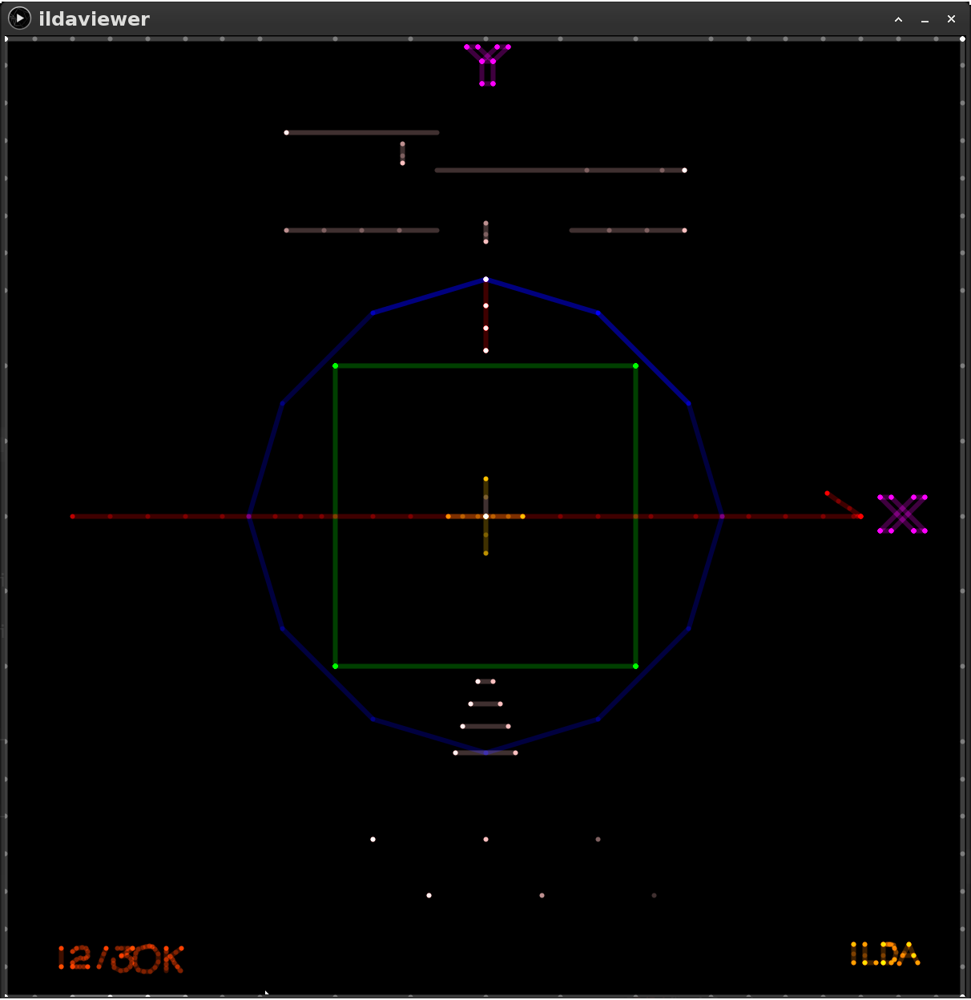
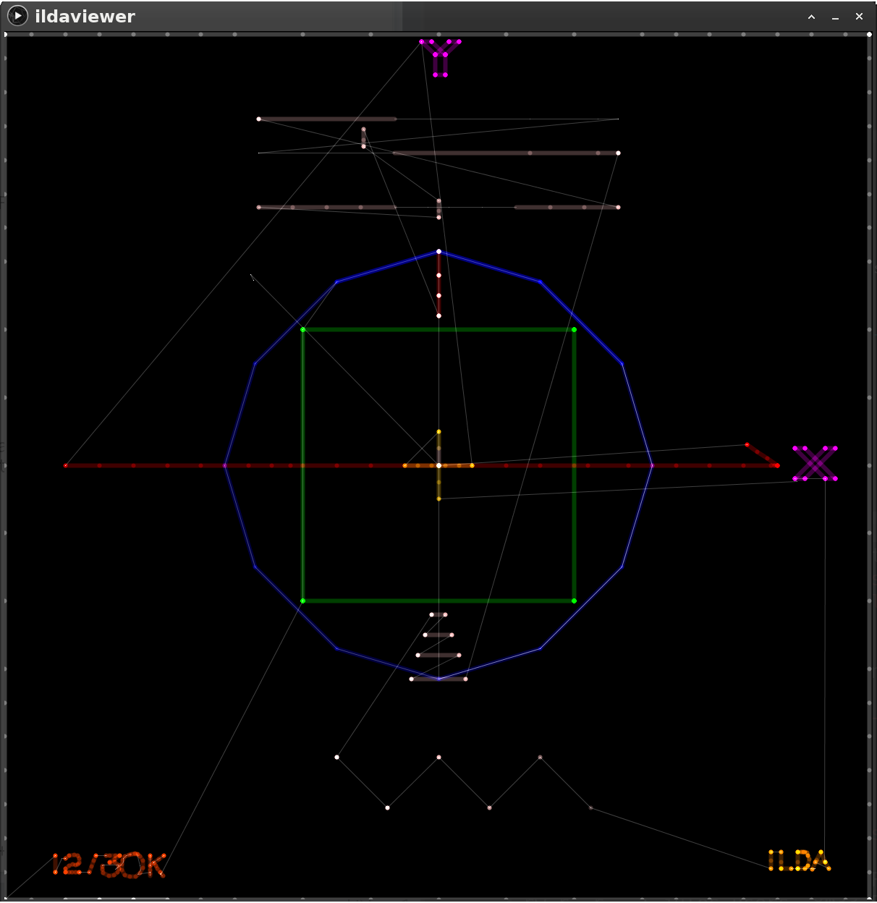

# ILDA Stuff

- ildaviewer.pde: A simple ILDA file player in Processing.

- IldaFile.pde: A Java library for loading "format 0" ILDA files. No dependence on Processing. Only supports one format: "Format 0 – 3D Coordinates with Indexed Color".

### References
***ILDA Image Data Transfer Format Specification:***
https://www.ilda.com/resources/StandardsDocs/ILDA_IDTF14_rev011.pdf

***ILDA Test Pattern:***
https://www.ilda.com/resources/StandardsDocs/ILDA_TestPattern95_rev002.pdf

